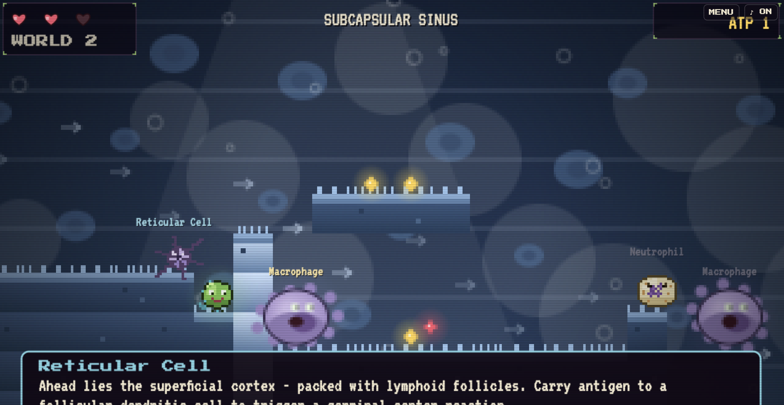

### *An interactive pixel companion to Ross Histology*

> Play through the microanatomy. Earn ATP. Pass your exam.

[](https://github.com/gravityeffect1/ross-by-gamers)
[](https://github.com/gravityeffect1/ross-by-gamers)
[](https://react.dev)
[](https://gravityeffect1.github.io/ross-by-gamers)
[](https://github.com/gravityeffect1/ross-by-gamers)

**[▶ Play Now](https://gravityeffect1.github.io/ross-by-gamers)**

</div>

---

## What is this?

A serialised browser-based pixel platformer where you navigate the interior architecture of human tissues, as a pathogen. Each chapter covers one body system from **Ross & Pawlina**, zoned and colour-coded to match real histological compartments.

Developed by a medical student, for medical students.


##  Chapter II — The Lymphatic System

<details>
<summary><strong>World 1 — The Vessel</strong> &nbsp;·&nbsp; Bloodstream → Connective Tissue → Afferent Lymphatic</summary>

<br>

| Compartment | Key concepts |
|-------------|-------------|
| Bloodstream | Macrophage polarisation (M1/M2), respiratory burst, MHC II antigen presentation |
| Loose connective tissue | Neutrophil extravasation — selectin rolling, integrin adhesion, chemokine gradients |
| Afferent lymphatic | T-cell activation signals 1/2/3, cytotoxic killing via perforin/granzyme |

</details>

<details>
<summary><strong>World 2 — The Lymph Node</strong> &nbsp;·&nbsp; Sinus → Cortex → Paracortex → Medulla → Efferent</summary>

<br>

| Compartment | Key concepts |
|-------------|-------------|
| Subcapsular sinus | Sinus macrophage filtration, reticular cell scaffold, type III collagen |
| Superficial cortex | Primary vs secondary follicles, germinal centre light/dark zones, somatic hypermutation via AID |
| Paracortex (HEV) | HEV diapedesis, 90% lymphocyte entry via blood, thymus-dependent zone |
| Medullary cords | Plasma cell morphology (clock-face nucleus, RER-rich cytoplasm, clear Golgi zone) |
| Efferent lymphatic | Antibody drainage, lymphocyte recirculation |

 **Quest:** Collect 3 antigens → deliver to follicular dendritic cells → unlock germinal centre facts + ATP bonus

</details>

<details>
<summary><strong>World 3 — The Spleen</strong> &nbsp;·&nbsp; White Pulp → Marginal Zone → Red Pulp → Venous Sinusoids</summary>

<br>

| Compartment | Key concepts |
|-------------|-------------|
| White pulp (PALS) | T-cell zone around central arteriole, B-cell follicles budding off PALS |
| Marginal zone | First contact for blood-borne pathogens, marginal zone B cells, asplenia risk (pneumococcus, H. influenzae, meningococcus) |
| Red pulp — cords of Billroth | Open vs closed circulation, RBC deformability testing, macrophage-mediated erythrophagocytosis |
| Venous sinusoids | Stave cells, slit-like fenestrations, haem catabolism (globin → amino acids; heme → iron + biliverdin → bilirubin) |

 **Quest:** Collect 3 senescent RBCs → deliver to Red Pulp Macrophage → unlock splenic vein exit + ATP bonus

</details>

---

## Controls

| Action | Key |
|--------|-----|
| Move | `←` `→` or `A` `D` |
| Jump | `Space` / `W` / `↑` |
| Double-jump | `Space` × 2 mid-air |
| Climb shaft | `↑` `↓` or `W` `S` on a ladder |
| Advance NPC dialogue | `E` / `Enter` / `Z` |
| Pause | `Escape` |


---

## 🎓 How learning works in-game

The game delivers content through three layers that activate without interrupting play:

```
┌─────────────────────────────────────────────────────────┐
│  1. SPATIAL MEMORY                                      │
│     Each compartment has a unique colour palette,       │
│     sky gradient, and tile texture. You recognise       │
│     the paracortex before you read the label.           │
├─────────────────────────────────────────────────────────┤
│  2. CONTEXTUAL FACTS                                    │
│     Proximity to an immune cell → fact banner fires.    │
│     Enter a new zone → architecture card appears.       │
│     Nothing is front-loaded — you earn it by exploring. │
├─────────────────────────────────────────────────────────┤
│  3. ACTIVE QUESTS                                       │
│     Antigen delivery (W2) and RBC recycling (W3)        │
│     require navigating across compartments — encoding   │
│     spatial relationships between zones into memory.    │
└─────────────────────────────────────────────────────────┘
```

---

##  Stack

| Layer | Tech |
|-------|------|
| UI framework | React 18 (CDN, no bundler) |
| Rendering | HTML5 Canvas — 320×180 pixel buffer upscaled 4× nearest-neighbour + 1280×720 text overlay |
| Audio | Web Audio API — procedural SFX, zero audio files |
| JSX compilation | Babel standalone 7.26.5 (in-browser) |
| Distribution | Single `index.html` — zero dependencies, zero build step |

---

##  Roadmap

- [ ] **Chapter III** — Cardiovascular System
- [ ] **Quiz encounters** — Undertale-style NPC dialogue transitions to full-screen immunology quiz, ATP rewards
- [ ] **Touch controls** — on-screen D-pad for tablet study sessions
- [ ] **Flashcard export** — per-zone collectible cards, exportable as PDF
- [ ] **localStorage progress** — carry ATP and chapter unlocks between sessions
- [ ] **Bone marrow world** — haematopoietic niches (standalone bonus world)


##  Source material

> Ross & Pawlina — *Histology: A Text and Atlas with Correlated Cell and Molecular Biology*, 8th edition.
> Zone boundaries, compartment naming, cell-type facts, and architectural descriptions are adapted directly from the relevant chapters.

---

<div align="center">

Made by [Sara Sovix](https://github.com/gravityeffect1) · MS2 · Faculty of Medicine, Bucharest

*built at the intersection of code and cellular biology*

</div>
